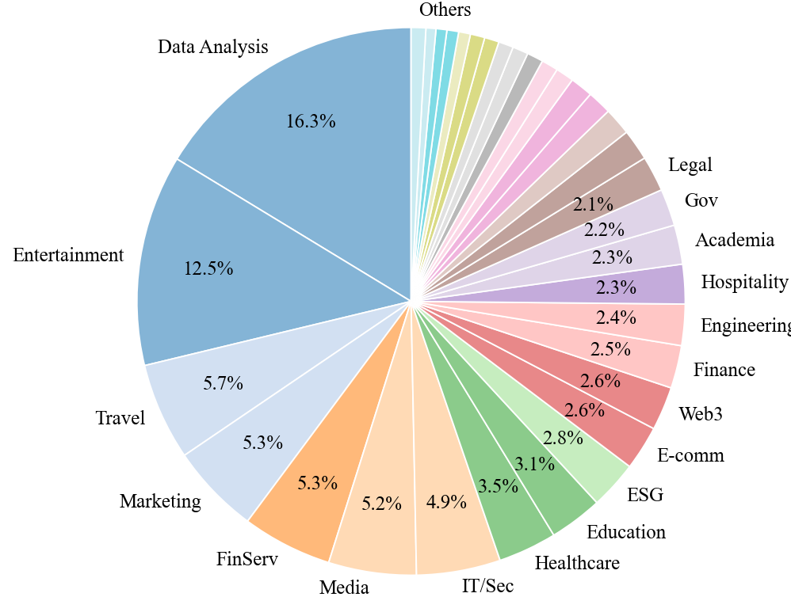
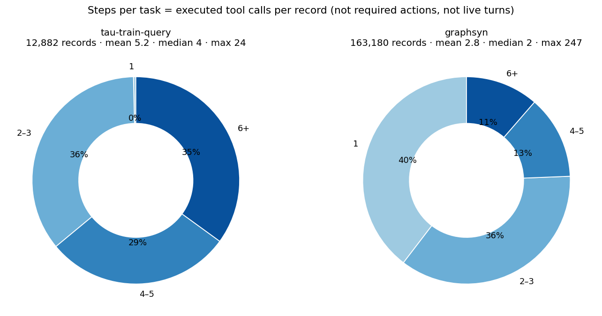

# Training Data Analysis — ToolMind

Two files downloaded from [Nanbeige/ToolMind](https://huggingface.co/datasets/Nanbeige/ToolMind):
`tau-train-query.jsonl` (12,882 records) and `graphsyn.jsonl` (163,180 records). Both are flat
SFT traces: `{conversations, tools}`, no domain/eval fields.

## 1. Domain recoverability

**Can we label each record's domain?**

- **`tau-train-query.jsonl` → yes, trivially.** All 16 tools are the tau-bench **retail** set
  (`get_order_details`, `cancel_pending_order`, …). 100% Retail — a one-slice pie.
- **`graphsyn.jsonl` → no, not from the data.** No domain field; records are random walks over a
  parameter-compatibility graph, so many splice unrelated worlds in one trace (e.g. candlestick
  trading + linguistics + forensics). Reproducing a per-record pie requires LLM-tagging the
  14,363 distinct tool names into categories — an inference pipeline, not a `groupby`.

**The authors' own pie** (`figures/domain_pie.png`, below) is **tool/API-level** categories, and
the tool→domain mapping was **not released**. It is unlabeled in the README but, by its category
names (Entertainment, Travel, Web3, ESG, Gov…), reflects the **synthetic `graphsyn`** tool space —
**not** the open_datasets (which are retail/airline + generic function-calling only).

## 2. Steps per task

Eval tasks use `len(evaluation_criteria.actions)` (a *reference* list) as the step proxy. Training
records are real trajectories, so we use the direct analog: **executed tool calls per record**,
bucketed 1 / 2–3 / 4–5 / 6+.

| bucket | tau-train-query | graphsyn |
|---|---|---|
| 1 | 0% | 40% |
| 2–3 | 36% | 36% |
| 4–5 | 29% | 13% |
| 6+ | **35%** | 11% |
| | median 4, max 24 | median 2, max 247 |

**tau-train is deep** (retail CS: verify → fetch → confirm → mutate; 64% need ≥4 calls). **graphsyn
is shallow** (40% are single-call lookups, 76% ≤3). Counts executed tool calls — not required
actions, not conversational turns.

## 3. Difficulty indicators

The eval rubric (`evaluation_criteria`) doesn't exist in SFT traces, so only 4 of 7 indicators
translate. Per-domain collapses to per-dataset (tau-train = single-domain Retail; graphsyn = no
native domains).

| indicator | tau-train-query | graphsyn | notes |
|---|---|---|---|
| mean tool calls / record | 5.2 | 2.8 | = "# actions" |
| mean distinct tools / record | 3.8 | 1.9 | |
| tool-vocabulary size | 16 | 14,733 | breadth |
| % write / mutating calls | **18.2%** (exact) | ~2.6%+ (unreliable) | retail: known tool set; graphsyn: verb heuristic leaves **54% unknown** |
| first-user-msg length (tokens) | 14 (med 13) | 32 (med 30) | = "instruction length" |
| # communicate_info | N/A | N/A | eval-only (no rubric) |
| # nl_assertions | N/A | N/A | eval-only (no grader) |
| dual-control | N/A | N/A | only the assistant calls tools in both |

**Hardest: tau-train / Retail** — it's the only set with genuine *task* depth: 5+ calls, ~4 distinct
tools, and a real **18% mutating-action rate** (cancel/return/exchange/modify) gated behind identity
verification, so the 82% reads are setup for irreversible writes. graphsyn is harder only in
*breadth* (14.7k tools) — per record it's a shallow 1–2-call lookup, mostly read-only, with no
verification gating. Depth vs breadth; the costly-mistakes live in Retail.

## 4. Exemplars

Difficulty axis = executed tool calls (§2). Domains collapse to datasets.

### tau-train-query (Retail)

- **Easy — `rec#14`, 4 calls.** *"Cancel two orders I placed by mistake."* Linear
  `find_user → get_user → get_order → cancel_pending_order`. Easy: one mutation type, cancellable
  state, single customer, no variant-matching.
- **Mid — `rec#7`, 4 calls.** *"Make an exchange for an item I purchased."* Verify, then fan out
  across orders to surface the right line-item before exchanging. Harder than cancel: the write needs
  matched `item_id`/`new_item_id` + a payment method for the price delta, so most calls are reads
  setting up one careful mutation.
- **Hard — `rec#1`, 15 calls.** *"Update the address for order #W3196599"* … which snowballs into
  address changes **and** item swaps across **two** orders, paid via gift card. Hard: long horizon,
  multiple mutation types, re-verification per order — and the trace even thrashes
  (`find_user_id_by_email` fired 6× redundantly), a noise tell worth dedup before SFT.

### graphsyn (synthetic, multi-domain)

- **Easy — `rec#1`, 1 call.** *"What's the current time in New York?"* → `get_current_time`. A
  single-shot lookup; no state, no follow-up. (40% of graphsyn lives here.)
- **Mid — `rec#21`, 5 calls.** *"How's Bitcoin done this past week — the 1-hour swings?"* Repeated
  `Binance Candlestick` calls + `market/get-summary` to assemble a series. Mid: coherent, multi-call,
  read-only, light aggregation reasoning.
- **Hard — `rec#11`, 10 calls.** *"Business trip to three cities — most efficient route **and** their
  ESG scores to compare."* Interleaves `getESGScores ×7` with `calculate_route`. Hard: multi-entity
  gather + routing optimization, juggling many parallel results.

**Caveat (graphsyn coherence):** the graph-walk also yields incoherent mashups — `rec#33` ("set up a
team-building event") fires `createChangeRequest → Search Anime Jokes → translatePhrase`; `rec#40`
("book a round-trip flight") ends on `Alarabiya News API`. Difficulty there is artificial: the tools
don't belong together, so the "hard" signal is partly noise, not genuine multi-step reasoning.
